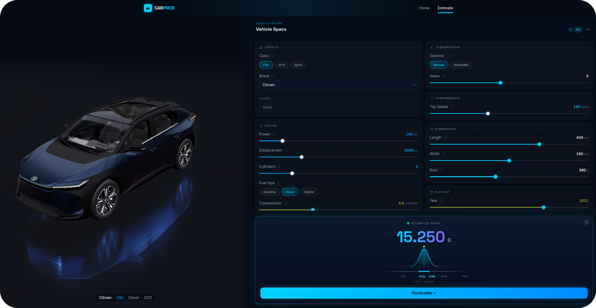

# Car Price Model

<a href="https://fbgranell.com/projects/car-price-model/"></a>

<p align="center">
  
  
  
  
</p>

Predicts second-hand vehicles prices in Spain: train an XGBoost regressor on scrapped listings, serve the model behind a small FastAPI service, and show it off with a 3D frontend.

# Live demo 

<a href="https://www.carpricemodel.com/"></a>


## Quickstart

```bash
# backend, :8000
cd backend
pip install -e .
uvicorn car_price_model.api.app:app --reload
```

```bash
# frontend, :5173
cd frontend
npm install
npm run dev
```

Full pipeline (cleaning → processing → training → summary):

```bash
python -m car_price_model.main
```

## API

Small FastAPI app (`api/app.py`), one endpoint. `CarSpecs` (`api/schemas.py`) keeps garbage out before it ever reaches the model. Numeric fields are bounded to roughly the training range, categoricals are locked to known enums (`api/enums.py`).

```bash
curl -X POST https://<api-host>/predict \
  -H "Content-Type: application/json" \
  -d '{
        "year": 2019, "cv": 150, "km": 60000,
        "fuel": "diesel", "gearbox": "automatic",
        "brand": "volkswagen", "boot": 380,
        "length": 450, "width": 180, "max_sp": 210,
        "cmixto": 5.2, "displac": 2000, "gear": 6,
        "class_": "standard", "n_cylinders": 4
      }'
# {"predicted_price": 18420}
```

`api/predict.py` runs the request through the same age/type conversions and the same fitted `Encoder` the model saw during training — nothing fancy, just making sure inference and training never drift apart.

## Data & pipeline

I scraped ~358K listings from [coches.com](https://www.coches.com/), split across six Spanish regions, into `backend/data/raw/`. From there it's four stages, each runnable on its own:

```
pipelines.cleaning     data/raw       -> data/interim/listings.parquet
pipelines.processing   data/interim   -> data/processed/{train,test,listings}.parquet
pipelines.modeling     data/processed -> models/car_price_model.joblib
pipelines.summary      data/processed -> models/summary.json (copied into frontend/)
```

`main.py` just chains all four.

Cleaning (`processing/cleaning.py`) turned out to be mostly about duplicates, not bad data: the same car gets posted in more than one region, units get glued onto numbers as strings, colors and locations and fuel types get spelled a dozen different ways. Raw rows go from ~359K to ~52K, and most of that drop is cross-region dupes. The mapping tables that unify categoricals live in `processing/mappings/`.

Processing (`pipelines/processing.py`) trims outliers by quantile (price, boot) and by count (age), splits 85/15, and fits the `Encoder` on train only. 

Every cleaning/outlier step logs its row count (`@log_row_count` in `utils/decorators.py`), so `backend/logs/pipeline.log` gives a full trace of what got dropped and when.

## Model

`CarPriceModel` (`modeling/car_price_model.py`) is a thin wrapper around `XGBRegressor`, using its native categorical support instead of one-hot encoding everything (`enable_categorical=True`, `tree_method="hist"`).

Tried linear regression, KNN, Random Forest and Catboost, but XGBoost won by a comfortable margin. Hyperparameters come from Optuna (`modeling/tune.py`): TPE sampler, median pruner, 300 trials, 5-fold CV maximizing R², with trials logged to MLflow. Tuning is opt-in (`modeling.run(tuning=True)`); day to day it just reuses `models/best_params.json`.

Current numbers on the held-out test set: R² 0.95, MAE ~€1,619, RMSE ~€2,440.

The residual std gets stored on the fitted model (`sigma`) and the API uses it to give a rough uncertainty range around each prediction, rather than just a bare number. `pipelines/summary.py` also precomputes per-column/class/brand stats and drops them straight into the frontend as `summary.json`, so the UI has context to show without another round trip to the API.

## Frontend

React + TypeScript, Vite, Tailwind, Framer Motion. The interesting bit is `frontend/src/components/three`: a 3D car (`@react-three/fiber`/`drei`) that reacts live as you drag the sliders in `components/predict`, hitting `/predict` on every change.

## Project structure

```
backend/
  src/car_price_model/
    api/            FastAPI app, request/response schemas, inference
    pipelines/      cleaning -> processing -> modeling -> summary
    processing/     cleaning, feature engineering, encoding, outlier removal
    modeling/       CarPriceModel (XGBoost wrapper), Optuna tuning
    data_io/        parquet/json/joblib read-write helpers
    statistics/     per-column / per-class / per-brand summary stats
  data/             raw -> interim -> processed
  models/           trained model, encoder, best hyperparameters, summary.json
  notebooks/        EDA, training and prediction exploration

frontend/
  src/
    api/            typed client for the /predict endpoint
    components/     predict form, 3D car viewer, layout, home
    pages/          HomePage, PredictPage
```

## Deployment

Two GitHub Actions workflows, split by path so a frontend change doesn't trigger a backend redeploy: `backend/**` pushes the Docker image to a [Hugging Face Space](https://huggingface.co/spaces/fbgranell/car-price-api), `frontend/**` deploys to Vercel.

## License

MIT — see [LICENSE.md](./LICENSE.md).
